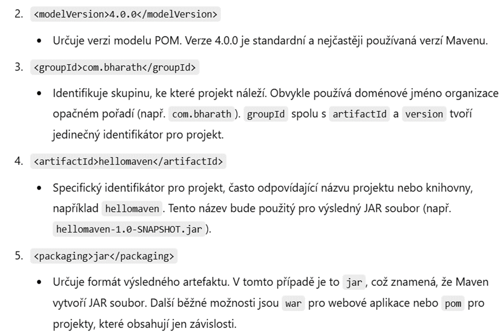
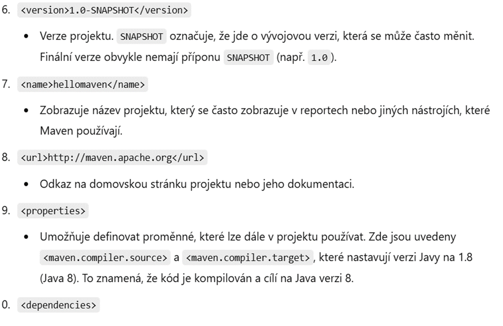

# Maven

# 📌 Úvod do Apache Maven

## 🔹 Co je to Maven?

Maven je **nástroj pro správu závislostí a automatizaci build procesu** v Javě.
Pomáhá nám snadno stahovat knihovny, sestavovat (buildovat) projekt a organizovat kód.

### 📦 Proč Maven?

- **Automatizuje správu závislostí** – stáhne potřebné knihovny.
- **Umožňuje jednotné sestavení projektu** – kompilace, testy, balení.
- **Podporuje opakovatelnost a sdílení projektů** – stejné nastavení pro všechny vývojáře.

## 🔹 Jak Maven funguje?

Maven pracuje s konfiguračním souborem `pom.xml`, kde definujeme:

- **Název projektu a jeho verzi**
- **Závislosti (dependencies)** – knihovny, které projekt potřebuje
- **Build proces** – jak se má projekt sestavit, testovat a nasadit

### 🔍 Ukázkový `pom.xml`

```xml

<project xmlns="http://maven.apache.org/POM/4.0.0"
  xmlns:xsi="http://www.w3.org/2001/XMLSchema-instance"
  xsi:schemaLocation="http://maven.apache.org/POM/4.0.0
         http://maven.apache.org/xsd/maven-4.0.0.xsd">
  <modelVersion>4.0.0</modelVersion>

  <groupId>com.example</groupId>
  <artifactId>muj-projekt</artifactId>
  <version>1.0-SNAPSHOT</version>

  <dependencies>
    <dependency>
      <groupId>org.springframework.boot</groupId>
      <artifactId>spring-boot-starter-web</artifactId>
      <version>2.7.0</version>
    </dependency>
  </dependencies>
</project>
```

🛠️ **Co tento soubor dělá?**

- Vytváří Java projekt s názvem `muj-projekt`.
- Přidává knihovnu `Spring Boot` pro tvorbu webových aplikací.
- Maven automaticky stáhne tuto knihovnu i její závislosti.

## 🔹 Instalace Mavenu

### 🖥️ Windows

1. Stáhni Maven z [oficiálních stránek](https://maven.apache.org/download.cgi).
2. Rozbal archiv a nastav proměnnou prostředí `MAVEN_HOME`.
3. Přidej `bin` složku Mavenu do `PATH`.
4. Ověř instalaci:
   ```sh
   mvn -version
   ```

### 🖥️ Linux/macOS

1. Použij balíčkový manažer:
   ```sh
   sudo apt install maven   # Debian/Ubuntu
   brew install maven       # macOS
   ```
2. Ověř instalaci:
   ```sh
   mvn -version
   ```

## 🔹 Základní příkazy Mavenu

📌 **Vytvoření nového projektu**

```sh
mvn archetype:generate -DgroupId=com.example -DartifactId=muj-projekt -DarchetypeArtifactId=maven-archetype-quickstart -DinteractiveMode=false
```

📌 **Stažení závislostí a sestavení projektu**

```sh
mvn clean install
```

📌 **Spuštění aplikace**

```sh
mvn exec:java
```

📌 **Spuštění testů**

```sh
mvn test
```

## 🔹 Shrnutí

✅ Maven pomáhá **spravovat knihovny** a **sestavit projekt**.
✅ Používá `pom.xml` pro konfiguraci.
✅ Automatizuje build proces a testování.
✅ Šetří čas vývojářům.

---
✉️ **Otázky?** Pokud máš nějaké dotazy, neváhej se zeptat! 😊

## Vysvelteni pom





`<modelVersion>` - Tento element specifikuje verzi modelu POM, kterým je 4.0.0.

`<parent>` - Tato část definuje rodičovský POM, ze kterého tento projekt dědí konfiguraci. Projekt
zdědil konfiguraci z
org.example:lekce_engeto verze 1.0-SNAPSHOT.

`<groupId>` - Jedná se o identifikátor skupiny, který identifikuje projekt. V tomto případě je
skupina com.v1.

`<artifactId>` - Toto je identifikátor artefaktu (tj. projektu). V tomto případě je to L09_Maven.

`<properties>` - Tato část obsahuje vlastnosti (properties) projektu. V tomto případě jsou zde
definovány vlastnosti pro
verzi kompilátoru Javy (maven.compiler.source a maven.compiler.target) a kódování zdrojových
souborů (
project.build.sourceEncoding). Kompilátor Java by měl používat verzi 17 pro zdrojové soubory a
cílovou platformu.
Zdrojové soubory by měly být kódovány v UTF-8.

`<packaging>` - Tato část specifikuje typ balíčku, který bude vytvořen pro tento projekt. V tomto
případě je balíček
typu JAR (Java Archive), což je běžný formát pro distribuci knihoven a aplikací napsaných v Javě.

`<version>` - Tato část definuje verzi projektu. V tomto případě je verze 0.1.0. Verze je číselný
řetězec, který
umožňuje identifikovat a sledovat změny v projektu v průběhu času.

## Přidat informaci o verze Javy

`<properties>
    <maven.compiler.source>1.8</maven.compiler.source>
    <maven.compiler.target>1.8</maven.compiler.target>
</properties>`

## Dependencies

https://mvnrepository.com/artifact/org.projectlombok/lombok

potom udelal update.

1) vysvetlit co je to Maven build

Fáze `pre-clean` v Mavenu je jedna ze standardních fází životního cyklu projektu. Tato fáze se
spouští před provedením
čistění (smazání) zdrojových a kompilovaných souborů projektu.

Během fáze `pre-clean` Maven vykonává různé úkoly definované ve vašem projektu, které je třeba
provést předtím, než
budou
soubory smazány. To může zahrnovat například:

- Odstranění dočasných souborů generovaných při předchozích sestaveních.
- Vyčištění adresářů určených pro kompilaci.
- Provedení konfiguračních úkonů před čištěním, pokud jsou definovány v pluginu nebo skriptech.

Fáze `pre-clean` poskytuje možnost provést úkoly před tím, než bude spuštěna samotná čistící
operace. To může být
užitečné
například pro přípravu prostředí nebo provedení dodatečných úprav před vyčištěním projektu.

1) spustit pres okno
2) spustit pres run configurations
3) podivat se na target